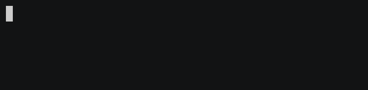

# @rtmpl/terminal

[![][ci-badge]][ci-link] [![][version-badge]][version-link]
[![][license-badge]][license-link]

[ci-badge]: https://github.com/clebert/rtmpl-terminal/workflows/CI/badge.svg
[ci-link]: https://github.com/clebert/rtmpl-terminal
[version-badge]: https://badgen.net/npm/v/@rtmpl/terminal
[version-link]: https://www.npmjs.com/package/@rtmpl/terminal
[license-badge]: https://badgen.net/npm/license/@rtmpl/terminal
[license-link]: https://github.com/clebert/rtmpl-terminal/blob/master/LICENSE.md

Build interactive terminal apps using reactive tagged template literals.

> Powered by [rtmpl](https://github.com/clebert/rtmpl)

## Installation

```
npm install @rtmpl/terminal --save
```

## Usage

### Greeting the world


<details>
  <summary>Show code</summary>

```js
import {Terminal, animate} from '@rtmpl/terminal';
import {TemplateNode} from 'rtmpl';
```

```js
const placeholderNode = TemplateNode.create``;

animate(placeholderNode, {
  frames: ['∙∙∙∙∙', '●∙∙∙∙', '∙●∙∙∙', '∙∙●∙∙', '∙∙∙●∙', '∙∙∙∙●', '∙∙∙∙∙'],
  interval: 125,
});

const salutationNode = TemplateNode.create`${placeholderNode}`;
const subjectNode = TemplateNode.create`${placeholderNode}`;

const close = Terminal.open(
  TemplateNode.create`${salutationNode}, ${subjectNode}!`
);

setTimeout(() => salutationNode.update`Hello`, 875);
setTimeout(() => subjectNode.update`World`, 875 * 2);
setTimeout(close, 875 * 2);
```

</details>

### Prompting the user


<details>
  <summary>Show code</summary>

```js
import {Terminal, animate} from '@rtmpl/terminal';
import {fingerDance} from 'cli-spinners';
import {TemplateNode} from 'rtmpl';
```

```js
const spinnerNode = TemplateNode.create``;

animate(spinnerNode, fingerDance);

const usernameNode = TemplateNode.create`Please enter your name ${spinnerNode}`;
const close = Terminal.open(usernameNode);

Terminal.instance
  .prompt()
  .then((username) => usernameNode.update`Hello, ${username || 'stranger'}!`)
  .finally(close);
```

</details>

### Listing tasks (as with [listr](https://github.com/SamVerschueren/listr))



<details>
  <summary>Show code</summary>

```js
import {Terminal, animate} from '@rtmpl/terminal';
import {green, red, yellow} from 'chalk';
import {star2} from 'cli-spinners';
import {TemplateNode, TemplateNodeList} from 'rtmpl';
```

```js
const taskNodeList = new TemplateNodeList({separator: '\n'});
const close = Terminal.open(taskNodeList.node);

Promise.allSettled([
  doSomeTask(taskNodeList, 'foo', 2000),
  doSomeTask(taskNodeList, 'bar', 3000),
  doSomeTask(taskNodeList, 'baz', 1000),
]).finally(close);
```

```js
async function doSomeTask(nodeList, title, duration) {
  const spinnerNode = TemplateNode.create``;

  animate(spinnerNode, {
    ...star2,
    frames: star2.frames.map((frame) => yellow(frame)),
  });

  const node = nodeList.add`  ${spinnerNode} ${title}`;

  const promise = new Promise((resolve, reject) => {
    setTimeout(() => (title === 'bar' ? reject() : resolve()), duration);
  });

  promise
    .then(() => node.update`  ${green('✔')} ${title}`)
    .catch(() => node.update`  ${red('✖')} ${title}`);

  return promise;
}
```

</details>

## Types

### `Terminal`

```ts
class Terminal {
  static get instance(): Terminal | undefined;
  static open(node: TemplateNode<unknown>): () => void;
  prompt(): Promise<string>;
}
```

### `animate`

```ts
function animate<TFrame>(
  node: TemplateNode<TFrame>,
  animation: Animation<TFrame>
): () => void;
```

```ts
interface Animation<TFrame> {
  readonly frames: readonly TFrame[];
  readonly interval: number;
  readonly nonTTY?: boolean;
}
```

---

Copyright 2021 Clemens Akens. All rights reserved.
[MIT license](https://github.com/clebert/rtmpl-terminal/blob/master/LICENSE.md).
